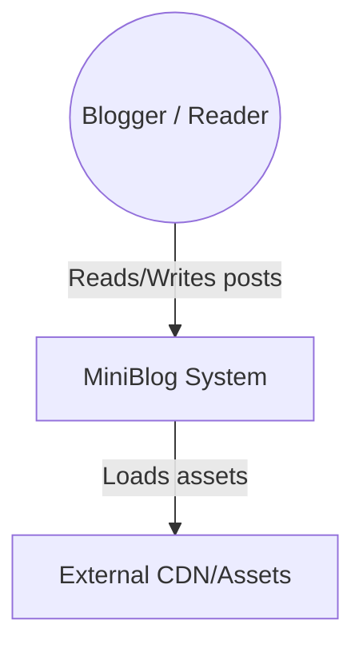
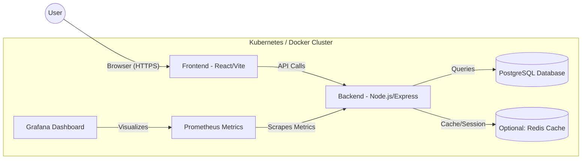
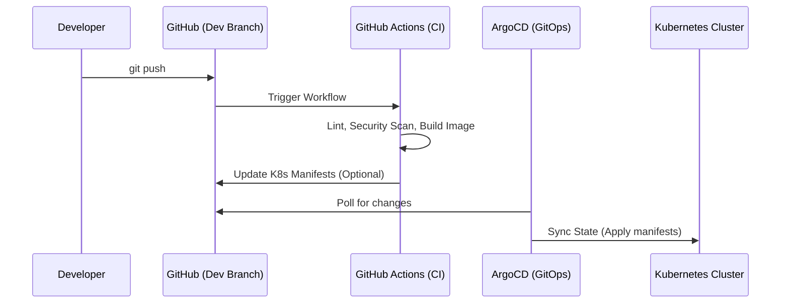
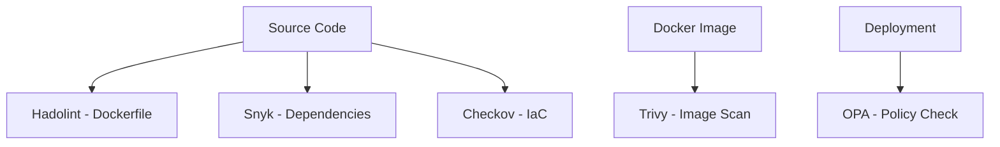

# MiniBlog Elite Architecture Documentation (C4 Model)

This document provides a high-level overview of the MiniBlog system architecture using the C4 model.

## 1. System Context Diagram
Describes how the MiniBlog system interacts with users and external entities.

## 2. Container Diagram (Micro-services & Data Store)
Detailed view of the internal containers.

## 3. Deployment Architecture (GitOps Flow)
How code travels from developer to production.

## 4. Security Architecture (DevSecOps)

